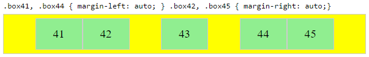

# 在 `CSS3 flex` 布局中, 为什么没有 `justify-self` 和 `justify-items` 属性

`flex` 容器内,主轴上元素的排列方法, 是如下定义的:

> 为了排列主轴上的 `flex` 元素, 我们有这样的一个属性: `justify-content`
>
> 而为了排列交叉轴上的 `flex` 元素, 我们却有三个属性: `align-content`, `align-items` 还有 `align-self`.

于是问题就出现了:
> 为什么在  `CSS3 flex` 布局中, 没有`justify-self` 和 `justify-items` 属性?

可以这样回答: **这两个额外的属性, 没有进行规范的必要。**

***
`flexbox` 的规范指出了两种排列主轴 `flex` 元素的方法:
1. `justify-content` 属性
2. `auto` `margins`

## `justify-content`
  `justify-content` 属性用来排布 `flex` 容器中, 主轴上的元素。
这个元素作用在 `flex` 的容器元素上, 但是会对所有 `flex` 容器里的子元素产生影响。

  下面是 5 种排列的选项:

  * `flex-start` ~ 元素靠近一行的开头
  
    

  * `flex-end` ~ 元素靠近一行的末尾
  
    

  * `center` ~ 元素靠近一行的中间
  
    

  * `space-between` ~ 元素被均匀的分散开, 其中, 第一个元素位于一行的开头, 而最后一个元素位于一行的末尾. 而一行的开头和末尾, 则由 `flex-direction` 还有 `writting mode`(`ltr` 或者 `rtl`)来决定。
  
    

  * `space-around` ~ 除了每个元素的开头和结尾都有一半的间隔以外, 和 `space-between` 是一样的。
    

## 自动外边距 (`Auto Margins`)

  `auto margin`(恰当的利用外边距的 `auto` 属性) 可以让元素居中排列、均匀分散或者是分组排列。

  `auto margin` 是作用在 `flex` 容器的子元素本身上的, 不像 `justify-content` 属性是作用在父级容器上的。

- #### 将一组子元素靠右排列, 而将第一个子元素单独靠左排列

  问题发生的情景:
  > 让一组 `flex` 元素靠右排列(`justify-content: flex-end`), 而其中的第一个元素, 靠左排列(`justify-self: flex-start`)
  >
  > 想象一下一个带有 logo 的导航条。如果有了 `justify-content` 和 `justify-self` 属性, 那么这个导航条就可以完美的用 `flex` 布局来实现, 从而如丝般顺滑的自适应各种尺寸的屏幕。

  
  


- #### 其他的可能会用到的场景:
  
  
  

- #### 把一个 `flex` 元素放到 `flex` 容器的一角:
  
    比如下面的场景:
    > 把一个 `flex` 元素放到 `flex` 容器的一角  `
    >
    > .box { align-self: flex-end; justify-self: flex-end; }`

    

- #### 水平垂直居中一个 `flex` 元素

    

    `margin: auto;` 可以用来替代 `justify-content: center;` `align-items: center;`, 就像下面这样：

    从
    ``` css
    .container {
        justify-content: center;
        align-items: center;
    }
    ```
    
    换成
    
    ``` css
    .box56 {
        margin: auto;
    }
    ```
    
    或许你会问, 这两个有什么区别呢？当你想<u>水平垂直居中一个大小超过</u> `flex` 容器 的 `flex` 元素时, 就会知道了。

- #### 居中一个 `flex` 元素, 然后在第一个 `flex` 元素和底边缘的中间再放置一个水平居中的 `flex` 元素

    `flex` 容器内元素的排列是通过分配剩余的空间来实现的。

    因此，为了在一个独立元素的旁边, 再居中放置一个元素, 必须对某些属性进行抵销。

    在下面的例子中, 不可见的第三个 `flex` 元素(`boxes 61 和 68`), 被用来实现居中布局, 以便让显示出来的元素(`boxes 63 和 66`)符合居中要求。
    
    
    

    不过，这种布局方法在语义上并无可取之处。
    
    我们也可以用伪元素来替代真实的 `DOM` 元素。也可以用绝对定位来实现这个要求，参见 [flexbox 中的绝对定位](http://stackoverflow.com/q/36191516/3597276) 中介绍的三种办法。
    
    注意: 上面的例子只适用于部分居中的要求 ———— 如果容器元素是等宽等高的，或者 `flex` 容器的子元素是不同长度的，再看看接下来的例子。

- #### 当相邻的元素尺寸不相同时，如何居中 `flex` 元素

    看下面的案例要求：
    
    > 1. 在某一行上有三个元素
    > 2. 实现第二个元素居中显示(`justify-content: center`)，而第一个和第三个分别靠左(`justify-self: flex-start`)和靠右显示(`justify-self: flex-end`)。
    >
    > 注意: `space-around` 和 `space-between` 在这里是无法达到想要的那种效果的，因为需要进行均匀排列的元素本身的宽度是不一样的([看这个例子](http://jsfiddle.net/7an37m20/12/))。

    正如上面提到的注意事项所说，在 `DOM` 结构上处于中间的那个元素，只有在相邻的元素等高或者等宽(取决于 `flex-direction`)的时候，才能真正的居中。这时候，我们就特别需要 `justify-self` 属性。

    ``` css
    #container {
      display: flex;
      justify-content: space-between;
      background-color: lightyellow;
    }
    .box {
      height: 50px;
      width: 75px;
      background-color: springgreen;
    }
    .box1 {
      width: 100px;
    }
    .box3 {
      width: 200px;
    }
    #center {
      text-align: center;
      margin-bottom: 5px;
    }
    #center > span {
      background-color: aqua;
      padding: 2px;
    }
    ```
    
    ``` html
    <div id="center">
      <span>真正的居中显示</span>
    </div>
    
    <div id="container">
      <div class="box box1"></div>
      <div class="box box2"></div>
      <div class="box box3"></div>
    </div>
    
    <p>只有当相邻元素的尺寸相同时，处于中间位置的 DOM 元素才能真正的居中显示。</p>
    ```

    ([点击这里](http://stackoverflow.com/questions/32551291/in-css-flexbox-why-are-there-no-justify-items-and-justify-self-properties), 前往原答案查看代码的效果)

    解决这个问题的办法有两种。
    
    - 方案一： 绝对定位
    
        `flexbox` 规定，允许其子元素用绝对定位进行布局。这样的话，相邻元素尺寸不相同的中间元素进行居中布局，也成为了有可能的事情。
        
        别忘了，绝对定位的元素会脱离文本流。这也就意味着它不再占据其容器元素的空间，并且可以和其他兄弟元素重叠在一起。
        
        在下面的例子中，三个子元素中间的那个元素用绝对定位，居中显示在了容器的正中央，而两个相邻的兄弟元素则仍然保持在文本流中。
        
        其实这个方法也可以反过来用：对三个字元素中间的那个元素使用 `justify-content: center` 属性，对它的两个兄弟元素用绝对定位。
        
    
    - 方案二： 嵌套使用 `flex` 容器(不使用绝对定位)
        ``` css
        .container {
          display: flex;
        }
        .box {
          flex: 1;
          display: flex;
          justify-content: center;
        }
        .box71 > span { margin-right: auto; }
        .box73 > span { margin-left: auto;  }
        
        /* non-essential */
        .box {
          align-items: center;
          border: 1px solid #ccc;
          background-color: lightgreen;
          height: 40px;
        }
        ```
        
        ``` html
        <div class="container">
          <div class="box box71"><span>71 短</span></div>
          <div class="box box72"><span>72 居中</span></div>
          <div class="box box73"><span>73 非常长长长长长长长长长长的元素</span></div>
        </div>
        ```
        
        ([点击这里](http://stackoverflow.com/questions/32551291/in-css-flexbox-why-are-there-no-justify-items-and-justify-self-properties), 前往原答案查看代码的效果)
        
        这种方法的工作原理：
        
        * 顶层 `div(.container`) 是一个 `flex` 容器
        * 每个 `div(.box`) 元素, 都是一个 `flex` 元素
        * 为了能均匀的分配容器的空间, 每个 .`box` 元素都被赋了 `flex: 1` 属性
        * 现在每行的元素所占据的容器空间都是想等的
        * 把每个 `flex` 元素都加上属性，变成 `flex` 容器(译注：就叫二级容器好了), 然后再在其中嵌套 `flex` 元素，并且给这些新的 `flex` 容器加上 `justify-content: center` 属性
        * 现在每个 `span` 元素是一个居中的 `flex` 元素了
        * 加上上面讲的自动外边距的方法, 让同一行中的外侧的二级容器分别靠左和靠右对齐
        之所以上面的方法可行，是因为在根据规范, 外边距的布局优先级是高于 `justify-content` 的：
        
        > 8.1. 用自动外边距来排列元素对应任何剩余的空间分配上, 自动外边距都有高于 `justify-content` 和 `align-self` 的分配权。
    
***
## `justify-content: space-same` (概念)

再回到 `justify-content` 这个属性上, 其实这个属性已经有了一个新的构想的值:

* `space-same` ~
  一种 `space-between` 和 `space-around` 的混合体。这个属性就像 `space-between` 一样能让元素均匀分布，只不过这次不是让两头的元素在外边缘之能分配到一半的空间了，而是分配到和两两元素中间一样大小的空间。

这种布局效果也能通过在 `flex` 容器上设置 ::`after` 和 ::`before` 两个伪元素来实现。

